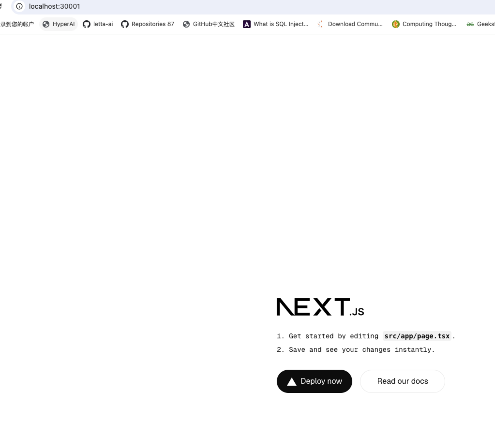

我将帮助您使用 Next.js 15 和 shadcn/ui 创建一个新项目。以下是具体步骤：

1. 首先，创建一个新的 Next.js 15 项目：

```bash
npx create-next-app@latest . --typescript --tailwind --eslint --app --src-dir --import-alias "@/*"
```

2. 安装和配置 shadcn/ui：

```bash
bunx -bun shadcn-ui@latest init
```

当运行上述命令时，会出现一些配置选项，建议按以下方式选择：
- Style → Default
- Base color → Slate
- Global CSS → src/app/globals.css
- CSS variables → Yes
- Tailwind prefix → ""
- Default themes → Yes
- React Server Components → Yes
- Components location → @/components
- Utilities location → @/lib/utils

3. 创建必要的目录结构：

```bash
mkdir -p src/components/ui src/lib
```

4. 修改 `src/app/globals.css` 文件以添加必要的样式：

```css:src/app/globals.css
@tailwind base;
@tailwind components;
@tailwind utilities;
 
@layer base {
  :root {
    --background: 0 0% 100%;
    --foreground: 222.2 84% 4.9%;

    --card: 0 0% 100%;
    --card-foreground: 222.2 84% 4.9%;
 
    --popover: 0 0% 100%;
    --popover-foreground: 222.2 84% 4.9%;
 
    --primary: 222.2 47.4% 11.2%;
    --primary-foreground: 210 40% 98%;
 
    --secondary: 210 40% 96.1%;
    --secondary-foreground: 222.2 47.4% 11.2%;
 
    --muted: 210 40% 96.1%;
    --muted-foreground: 215.4 16.3% 46.9%;
 
    --accent: 210 40% 96.1%;
    --accent-foreground: 222.2 47.4% 11.2%;
 
    --destructive: 0 84.2% 60.2%;
    --destructive-foreground: 210 40% 98%;

    --border: 214.3 31.8% 91.4%;
    --input: 214.3 31.8% 91.4%;
    --ring: 222.2 84% 4.9%;
 
    --radius: 0.5rem;
  }
 
  .dark {
    --background: 222.2 84% 4.9%;
    --foreground: 210 40% 98%;
 
    --card: 222.2 84% 4.9%;
    --card-foreground: 210 40% 98%;
 
    --popover: 222.2 84% 4.9%;
    --popover-foreground: 210 40% 98%;
 
    --primary: 210 40% 98%;
    --primary-foreground: 222.2 47.4% 11.2%;
 
    --secondary: 217.2 32.6% 17.5%;
    --secondary-foreground: 210 40% 98%;
 
    --muted: 217.2 32.6% 17.5%;
    --muted-foreground: 215 20.2% 65.1%;
 
    --accent: 217.2 32.6% 17.5%;
    --accent-foreground: 210 40% 98%;
 
    --destructive: 0 62.8% 30.6%;
    --destructive-foreground: 210 40% 98%;
 
    --border: 217.2 32.6% 17.5%;
    --input: 217.2 32.6% 17.5%;
    --ring: 212.7 26.8% 83.9%;
  }
}
 
@layer base {
  * {
    @apply border-border;
  }
  body {
    @apply bg-background text-foreground;
  }
}
```

5. 创建 utils.ts 文件：

```typescript:src/lib/utils.ts
import { type ClassValue, clsx } from "clsx"
import { twMerge } from "tailwind-merge"
 
export function cn(...inputs: ClassValue[]) {
  return twMerge(clsx(inputs))
}
```

现在您的项目已经设置完成，可以开始使用 shadcn/ui 的组件了。要安装组件，可以使用以下命令：

```bash
npx shadcn-ui@latest add button
```

这将安装 button 组件。您可以根据需要继续添加其他组件。

添加所有组件:

```bash
bunx -bun shadcn-ui@latest add
```

要测试安装是否成功，可以修改 `src/app/page.tsx`：

```typescript:src/app/page.tsx
import { Button } from "@/components/ui/button"

export default function Home() {
  return (
    <main className="flex min-h-screen flex-col items-center justify-between p-24">
      <Button>Click me</Button>
    </main>
  )
}
```

启动开发服务器：

```bash
bun run dev
```

现在您可以访问 http://localhost:3000 查看您的应用程序了。您会看到一个居中的按钮，这表明 shadcn/ui 已经成功集成到您的项目中。

这个设置为您提供了一个完整的开发环境，包括：
- Next.js 15 的所有现代特性
- TypeScript 支持
- Tailwind CSS 的样式解决方案
- shadcn/ui 的组件库
- ESLint 的代码质量控制

您可以继续在这个基础上构建您的应用程序了。

